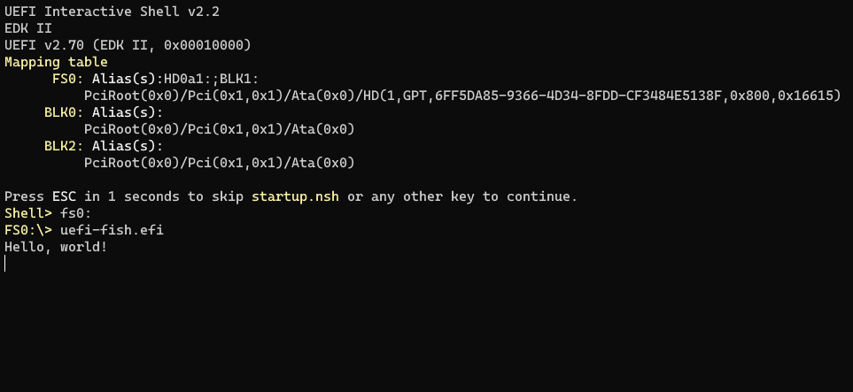

# uefi experiment

My first Rust project that isn't [an abomination of the type system](https://play.rust-lang.org/?version=stable&mode=debug&edition=2021&gist=860806de48acf3c337ce16528e543049).

An experiment to see how far I could get with `uefi-raw`, no macros, and a not-`unsafe` `main`.
